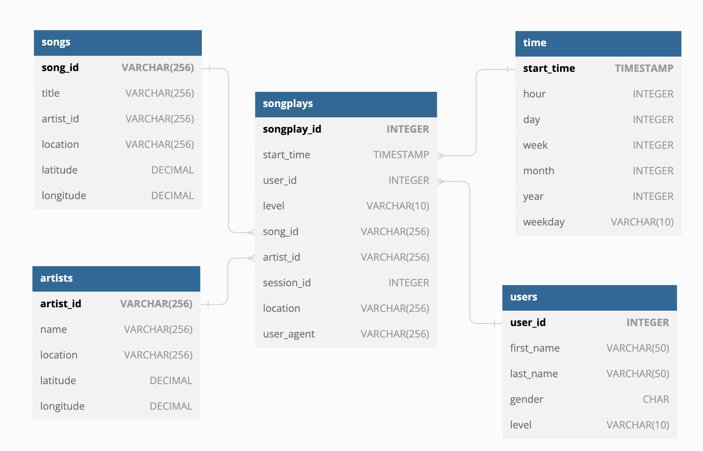

# Data warehouse AWS Data engineer nanodegree Udacity

The repository contains the project information of the **Project: Data Warehouse**

#### Context

A startup called Sparkify has grown their user base and song database and want to move their processes and data onto the cloud. Their Data resides in S3, in a directory of JSON.

### Data sources

We have 2 datasets that reside in S3

- **Song data:** Is a subset of real data from the [Million Song Dataset](http://millionsongdataset.com/). Each file is in JSON format.
- **Log Data:** Is a log files in JSON format generated by this [event simulator](https://github.com/Interana/eventsim) based on the songs in the dataset above.

### Data base schema

We create two staging tables

##### Staging Tables

- **staging_songs:** info about songs
- **staging_evets:** info about user actions

##### Fact table

- **songplays:** records in event data associated with song plays i.e. records with page NextSong

##### Dimension tables

- **users:** users in the app
- **songs:** song in music database
- **artists:** songs in music database
- **time:** timestamps of records in songplays broken down into specific unit

The star Schema looks like this:

#### How to running the project

##### Configuration Datawarehouse

- Create a new IAM user with AdministratorAccess policies in your AWS account

##### Redshift cluster creation scripts:

- `cluster/cluster.cfg` Define cluster configuration.
- `cluster/start.py:` Script to create redshift cluster and other necessary configurations.
- `cluster/drop.py:` Script to remove cluster and clean all related resources

##### Create Tables and load data

- Run `creates_tables.py` for create tables into redshift cluster
- Run `etl.py` to load data
